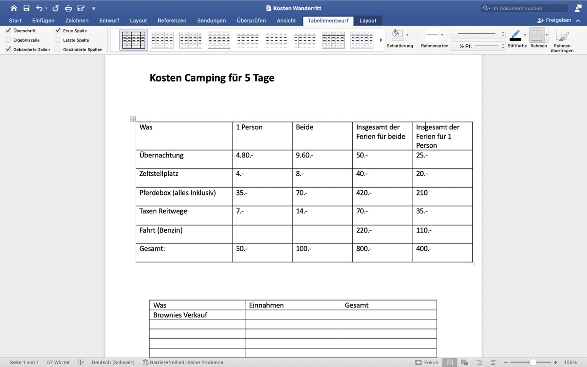

+++
title = "Abschlussreise"
date = "2023-11-15"
draft = false
pinned = false
image = "gross-bildschirmfoto-2023-11-15-um-11.36.17-.jpeg"
+++

Jaël und ich planen eine Abschlussreise im Mai oder Juni. Unsere Idee war zunächst, mit Fahrrädern von Marseille nach Saintes-Maries-de-la-Mer zu fahren. Allerdings sind wir nun auf die Idee eines Wanderritts gekommen und sind vollständig in der Planung vertieft.

Unser aktueller Plan sieht vor, für eine Woche in den Jura zu reisen. Dort möchten wir mit meinen beiden Pferden auf einem Campingplatz mit Boxen für die Pferde übernachten und tagsüber die wunderschönen Reitwege im Jura erkunden.                                                                                                                                 Nachdem wir uns für ein ungefähres Ziel-Dorf entschieden haben, haben wir einen geeigneten Campingplatz mit Pferdeboxen gesucht. Wir haben Preise, Standort, Infrastruktur usw. verglichen und sind nun auf einen ziemlich guten Campingplatz gestossen.

Heute haben wir die Gesamtkosten berechnet und überlegt, wie wir das Geld dafür zusammenbekommen können, unser Ziel ist es, das ganze selber zu finanzieren. Wir waren positiv überrascht, wie "wenig" das Ganze kostet, einschliesslich Fahrtkosten, Pferdefutter, Boxen, Zeltstellplatz, Reitwegtaxen usw. für uns beide und die beiden Pferde. Insgesamt belaufen sich die Kosten auf 800 CHF für 5 Nächte, exklusive unserer Verpflegung.

Nun steht noch die Datumssuche an, und sobald wir passende Termine gefunden haben, werden wir die Reise so bald wie möglich buchen. Wir freuen uns bereits sehr darauf, und die gesamte Planung macht uns grossen Spass.