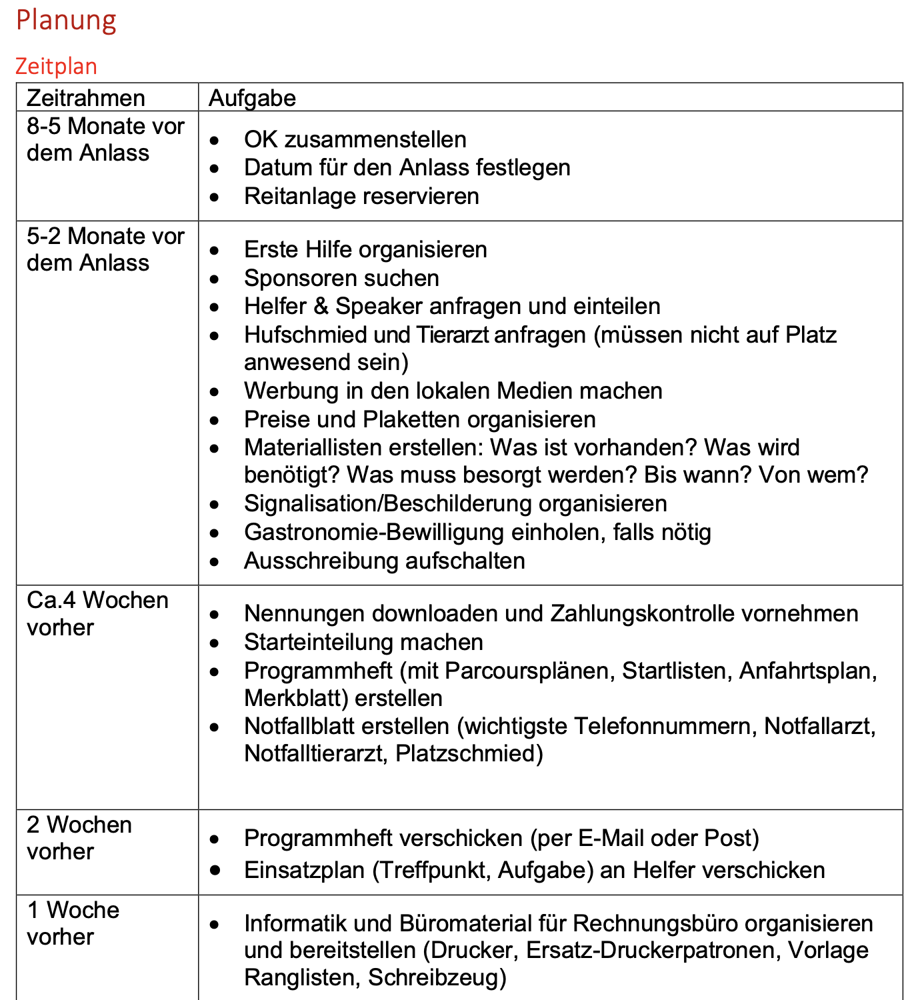

+++
title = "Anlass organisieren "
date = "2023-11-17"
draft = false
pinned = false
image = "bildschirmfoto-2023-11-17-um-11.38.44.png"
+++
Im Juni möchte ich einen Pferdesportevents durchführen und beschäftige mich gerade intensiv mit all den erforderlichen Vorbereitungen. 

Die Idee kam mir, da ich extrem gerne Organisiere und Plane. Schon seit Langem hege ich den Wunsch, einen Horseathlon zu organisieren und nun bietet sich endlich die Gelegenheit dazu. Die bisherigen Veranstalter haben entschieden, diesen Anlass nicht mehr zu übernehmen. Da mir dieser Event jedoch sehr am Herzen liegt, setze ich jetzt alles daran, denn ich verfüge über die nötige Zeit, um diesem Vorhaben gerecht zu werden.

Es gibt zahlreiche Aspekte, die berücksichtigt werden müssen. Angefangen beim Festlegen des Datums über das Zusammenstellen des Organisationskomitees, die Suche nach Helfern, das Ausschreiben der Veranstaltung, die Reservierung der Anlage bis hin zur Erstellung und Versendung des Programmhefts – es gibt viele Details zu beachten. Darüber hinaus müssen Angelegenheiten wie Haftpflichtversicherung, die Beantragung der Gaststättenbewilligung und ähnliche Themen gründlich recherchiert werden!

Natürlich kann ich einen so grossen Anlass mit 50 Startern nicht alleine organisieren; dafür braucht es viele Helfer!

