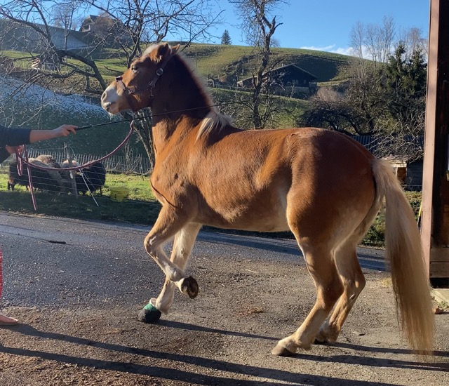

+++
title = "Einfach mal Ausprobieren"
date = "2023-12-20"
draft = false
pinned = false
image = "mittel-img_4184-.jpeg"
+++
Es gibt unzählige Anleitungen darüber, wie man etwas lernt, tut oder beibringt. Allerdings finde ich, dass vieles durch selbstständiges Ausprobieren besser funktioniert.

Ein Beispiel:

Ich wollte meinem Pferd schon lange den Schulhalt beibringen, eine Lektion, bei der das Pferd lernt, die Hinterbeine zu beugen – vergleichbar mit Kniebeugen bei Menschen – und sich so besser selbst zu tragen und anatomisch korrekt zu laufen. Ich habe zahlreiche Anleitungen gelesen, Videos geschaut und Leute gefragt, wie sie es beigebracht haben. Ich habe alles ausprobiert, jedoch über eine sehr lange Zeit kaum Fortschritte erzielen können. Dann habe ich mich entschieden, meinem Bauchgefühl zu folgen und einfach auszuprobieren. Nach nur zwei Übungseinheiten habe ich bereits erstaunliche Fortschritte erzielt! Es ist noch nicht perfekt, aber es fehlen nur noch Details. Das alles konnte ich in etwa einem halben Jahr nach Lehrbuchübungen nicht erreichen. Ich hatte immer das Gefühl, dass sie das Ganze nicht versteht, aber jetzt denkt sie richtig mit und versteht es auch.

Ein weiteres Beispiel:

Mein Pferd wollte früher nie in den Hänger einsteigen. Laut Lehrbüchern sollte man Futter in den Hänger stellen und mit Seilen eine Gasse bilden, dann das Pferd sozusagen "Reindrücken". Bei ihr hat das jedoch nie funktioniert, es gab immer dasselbe Drama trotz Druck und Futter. Dann sind wir einmal mit einer Gerte (vor der sie natürlich keine Angst hat; es ist lediglich eine Verlängerung meines Arms, um mich nicht unnötig in Gefahr zu bringen) hinten an den Hänger gegangen und haben sie damit aufgefordert, jetzt bitte weiter zu gehen. Seit diesem Tag geht sie ohne Probleme in den Hänger! bei anderen Pferden funktioniert das super, aber es ist jedes Lebewesen anders.

Gestern habe ich einfach für mich gemerkt, das oftmals einfach ausprobieren das beste Lehrbuch ist.

