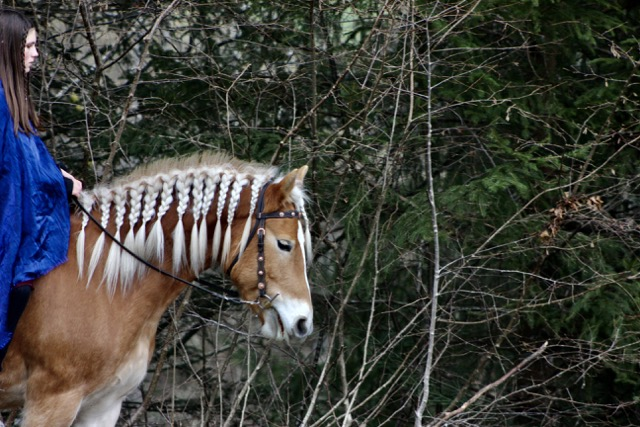

+++
title = "Entschieden"
date = "2024-01-05"
draft = false
pinned = false
image = "mittel-img_9166-.jpeg"
+++
Ich habe mich dazu entschieden, bei meinem ursprünglichen Weg zu bleiben. Ich habe einfach aufgehört, darüber nachzudenken und wusste dann einfach, dass es für mich sso richtig ist. Mein aktueller Plan sieht vor, dass ich zunächst auf dem Hof, auf dem auch die Lehrstelle gewesen wäre, ein halbes Jahr Praktikum mache. 

Im Februar, werde ich mit meiner Mutter und meiner Schwester, eine Woche nach Andalusien in den Urlaub fahren. Auf einen Hof, der der Familie einer ziemlich bekannten Pferdetrainerin gehört wo ich schon lange mal hinwollte. Die Idee genau jetzt dahin zugehen kam mir, weil momentan eine meiner Lieblings-Pferdeinfluencerinnen/Pferdetrainerinnen mit ihren Pferden dort ist und es sich dann gleich doppelt lohnt. Ich könnte mir gut vorstellen, dort ein Praktikum zu absolvieren. Allerdings ist es so, dass die Meinungen über diesen Hof sehr unterschiedlich sind: Einige finden es dort grossartig, während ich auch viel Negatives darüber gehört und gesehen habe. Daher passt es perfekt, dass wir dorthin in den Urlaub fahren, und ich mir selbst ein Bild machen kann.

