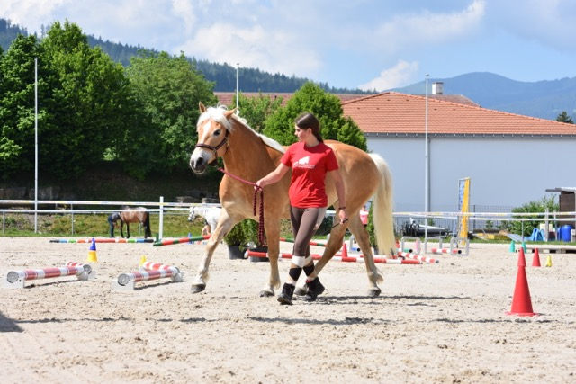
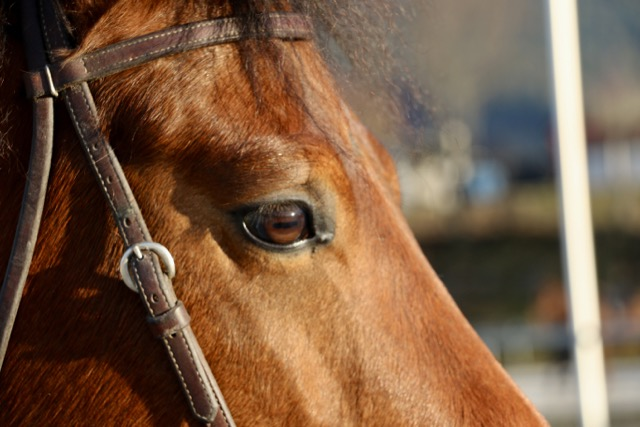
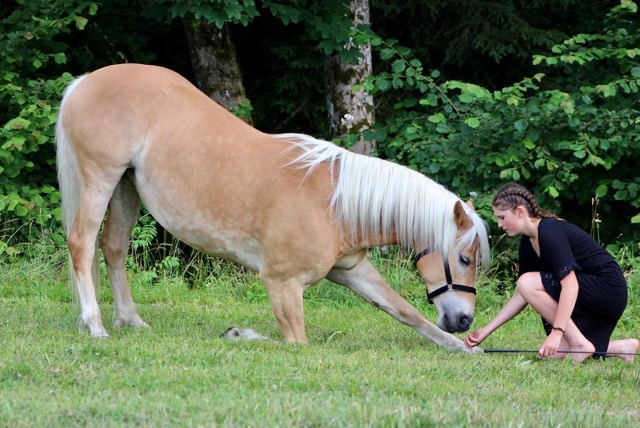

+++
title = "Meine aktuellen Projekte"
date = "2024-01-24"
draft = false
pinned = false
image = "mittel-img_2084-.jpeg"
+++
Aktuell habe ich viele Spannende Projekte. Einerseits bereitet mir das große Freude und Spaß, andererseits muss ich darauf achten, mich nicht zu überfordern.

Projekt Nummer 1:
Die Organisation des Horseathlons ist derzeit mein Hauptfokus. Ich bin intensiv auf der Suche nach Sponsoren, schreibe sie an und kümmere mich um die Koordination verschiedener Aufgaben. Hierzu zählen die Mittagessenplanung, Getränkeversorgung, die Suche nach Helfern, sowie die grobe Einteilung für Aktivitäten wie Mistsammeln, Infostand, Fotografie und vieles mehr. (Falls jemand Lust und Zeit hat, seid ihr alle Herzlich Willkommen am 2. Juni in Plaffeien vorbei zu kommen!)

Projekt Nummer 2:
Neben der Lehrvideoserie, die ich im Herbst zusammen mit Jaël gestartet habe und die wir im Frühling fortsetzen werden, arbeite ich an einem weiteren Pferde-Videoprojekt. Gemeinsam mit meinem Reitlehrer präsentieren wir, was sein Jungpferd in zwei Jahren Training nach diesem Konzept bereits gelernt hat. Wir planen 7-10 Instagram-Videos zu veröffentlichen und am Ende eine Zusammenfassung auf YouTube zu präsentieren. Das Ziel ist es, jede Woche ein Video auf Instagram zu posten. Ich bin ein- bis zweimal pro Woche auf dem Hof, filme alles, schneide die Videos und veröffentliche sie. Wenn es dich interessiert, kannst du gerne auf Instagram bei Horseathlon vorbeischauen – das erste Video werden wir in den nächsten Tagen veröffentlichen.

Projekt Nummer 3:
Am 4. Mai werde ich in der großen Arena der BEA im Rahmen des Nachmittagsprogramms "Manege frei für deine Show" mit meinem Pferd auftreten. Hierfür muss ich ein tolles Programm, ein passendes Kostüm, die richtige Musik und alles, was dazugehört, vorbereiten – und vor allem viel üben!

Das sind derzeit meine größten Projekte, aber natürlich gibt es noch viele weitere spannende Vorhaben!

