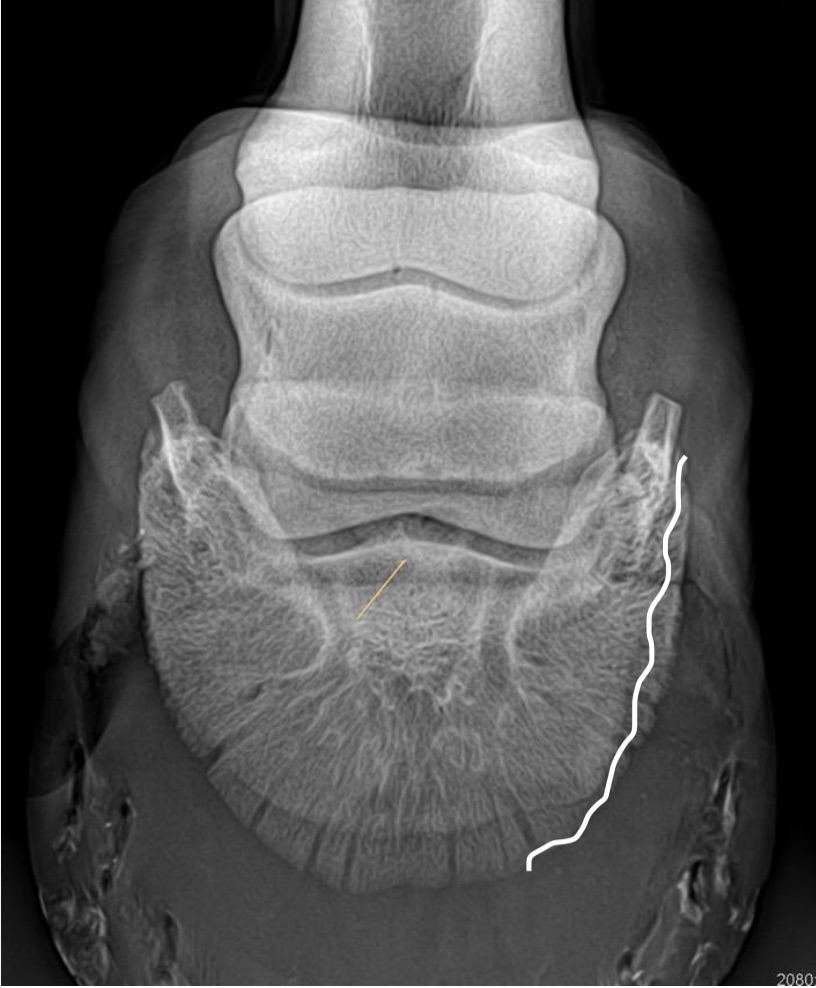
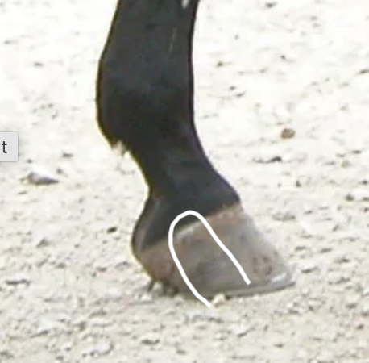
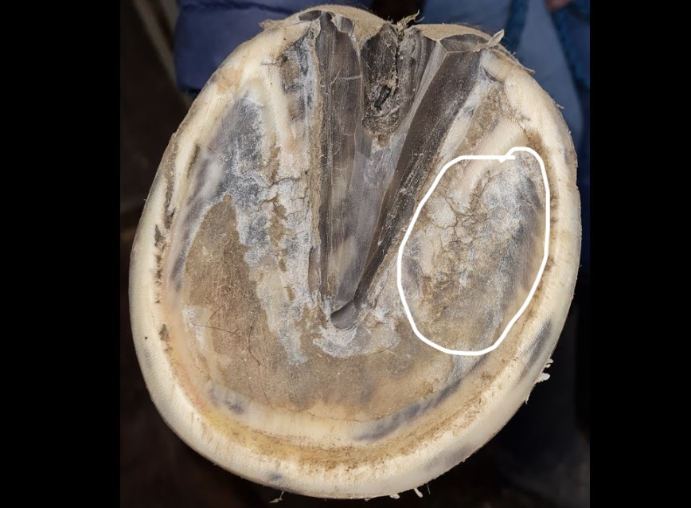

+++
title = "Niala - schwere Zeiten"
date = "2023-11-22"
draft = false
pinned = false
image = "bildschirmfoto-2023-11-22-um-10.45.22.jpeg"
+++
Mein Pferd hatte Ende September einen Hufabszess, dass ist eine eitrige Entzündung im Inneren des Hufs, die ausgeschnitten werden musste, um den Eiter abfließen zu lassen. Die Verletzung schien zunächst abgeheilt zu sein, aber am Freitag wurde sie leider wieder lahm und am Sonntag konnte sie kaum noch laufen. Es war für mich sehr schwer, sie so leiden zu sehen. Wir waren auch besorgt, ob möglicherweise etwas gebrochen war, und in den meisten Fällen ist ein Bruch am Bein/Huf nicht mehr heilbar, und die einzige Option bleibt, das Pferd einzuschläfern.

Am Montag kam die Tierärztin und führte zuerst eine Röntgenuntersuchung durch. Am Hufbein (dem untersten Knochen im Huf) fehlt an der Außenseite ein Stück, wahrscheinlich schon seit ihrer Kindheit, von dem wir bisher jedoch nichts bemerkt hatten. Jetzt hatte sich dies jedoch entzündet, und die Tierärztin musste den gesamten Huf bis zum knochen aufschneiden (das Bein war dafür betäubt). Nun erhält sie täglich Schmerzmittel, und die Tierärztin muss alle zwei Tage zum Verbandwechsel kommen. Leider kann sie kaum laufen, liegt die meiste Zeit und hat sichtlich starke Schmerzen. Trotz allem bin ich sehr froh, dass sie wieder gesund wird!

Für mich ist sie mehr als nur ein Pferd, sie ist meine beste Freundin, mein "Sportpartner", und ich trage gleichzeitig die Verantwortung dafür, dass es ihr gut geht! Ich bin mir sicher, dass ich nicht so schnell wieder ein Pferd finden werde, zu dem ich eine derartige Verbindung spüren kann, das so perfekt zu mir passt, sei es im Charakter, im Körperbau/Grösse oder in sportlicher Hinsicht. Die Beziehung zwischen einem Pferd und seinem Besitzer ist für Nicht-Reiter vielleicht schwer nachvollziehbar aber sie ist das Beste, was mir je passiert ist!

Etwas, was mir immer wieder auffällt und fasziniert, ist bei Pferden, aber auch bei Hunden, wie sie und ihre Bezugsperson sich ähnlich sehen in Gesichtszügen usw. und auch im Charakter: Zum Beispiel sind Niala (mein Pferd) und ich beide ziemlich stur, und wenn wir auf etwas keine Lust haben, kann uns niemand dazu bringen, es trotzdem zu tun. Wenn wir jedoch etwas gerne machen, sind wir sehr motiviert und mit viel Ehrgeiz bei der Sache.

 Die weisse linie ist wie es bei ihr aussieht   

So hoch mussten wir ausschneiden

Da ist die verletzung