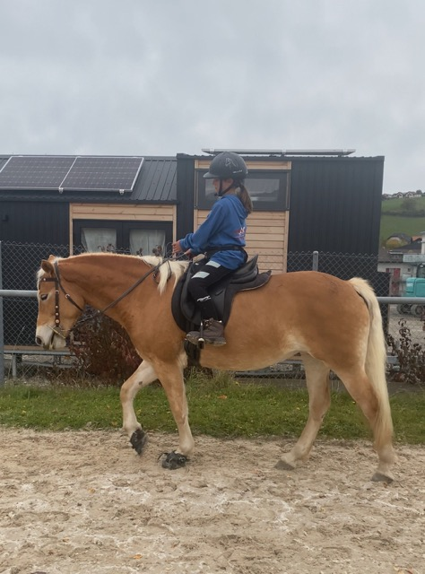

+++
title = " Pferde- und Kindertag"
date = "2023-11-24"
draft = false
pinned = false
image = "mittel-img_2762-.jpeg"
+++
Gestern habe ich gemeinsam mit meiner Mutter und Jael einen Pferdeerlebnistag mit 6 Kindern (eigentlich sollten es 8 sein, aber Niala konnten wir nicht einsetzen) bei uns zu Hause durchgeführt. Für diesen Tag hatte ich im Voraus viel geplant. Wir haben die Kinder in 3 Gruppen mit jeweils 2 Kindern aufgeteilt, und es gab etwa 5 Stationen/Aufgaben: Ausreiten, Erkennen und Sammeln von giftigen sowie gesunden Pflanzen für Pferde, Stallarbeit, Pferdepflege, Zirkustricks, Pferdefütterung und Teja hat momentan ziemlich viele Küken, die ebenfalls eine sehr beliebte Attraktion waren!

Alles in allem hat es Spaß gemacht. Allerdings fand ich es ziemlich herausfordernd, da 1-2 Kinder Schwierigkeiten mit der Konzentration hatten und immer weglaufen oder etwas anderes machen wollten. Nach dem Reiten wird das Pferd immer massiert und gefüttert. Zwei Kinder, die es massieren sollten, sind einfach weggelaufen oder haben die ganze Zeit gefragt, ob es nun endlich genug sei. Wir hatten dann eine Idee, die sich als ziemlich gut herausstellte: Wir gaben ihnen die Aufgabe, für 2 Minuten nicht zu sprechen und genau zu beobachten, wie das Pferd auf die Massage reagiert. Danach konnten uns die beiden sehr genaue und detaillierte Informationen darüber geben, was sie beobachtet haben.

Die Kinder waren danach sehr begeistert und haben ihren Eltern noch Zirkustricks vorgeführt sowie die Hühner gezeigt.

Ich kann mir gut vorstellen, einmal im Monat entweder einen Pferde- oder Hof-Erlebnistag zu veranstalten. Ich glaube nämlich das es sehr viele Kinder gibt, die gerne eigene Tiere hätten, es ihnen aber nicht möglich ist. Auf diese Weise könnten wir ein wenig Geld verdienen, und die Kinder könnten viel über Tiere und Natur erfahren und erkunden.

