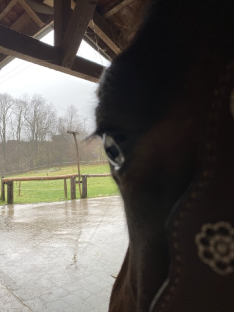

+++
title = "Praktikum und eine grosse Entscheidung"
date = "2023-12-13"
draft = false
pinned = false
image = "mittel-img_3634-.jpeg"
+++

Es war geplant, dass ich die letzten zwei Wochen ein Praktikum auf dem Sellenhof absolviere. Leider war ich in der ersten Woche durchgehend krank und musste daher zuhause bleiben. Dennoch war ich von Montag bis Dienstag der nächsten Woche vor Ort. Dort wurde mir eine Lehrstelle als Pferdefachfrau EFZ angeboten. Aus verschiedenen Gründen überlege ich nun intensiv, ob ich diese nicht doch annehmen möchte.

Ein typischer Tag könnte folgendermaßen aussehen:

* 06:20 Uhr: Aufstehen
* 06:30 Uhr: Morgenstall
* 08:00 Uhr: Frühstück
* 08:50 Uhr: Tagesplanung
* 09:00 Uhr: Vorbereitung eines Pferdes für jemand anderen
* 09:30 Uhr: Putzen und Training eines Pferdes
* 10:30 Uhr: Stallarbeit
* 11:30 Uhr: Vorbereitung eines Pferdes
* 12:00 Uhr: Stallarbeit
* 13:00 Uhr: Mittagessen
* 14:00 Uhr: Vorbereitung eines Pferdes
* 14:30 Uhr: Stallarbeit
* 16:00 Uhr: Aktuelle Hofarbeiten
* 17:00 Uhr: Reitstunde geben oder Stallarbeit
* 18:00 Uhr: Feierabend

Die Deadline für die Annahme oder Ablehnung der Lehrstelle ist der 31. Dezember. Momentan denke ich intensiv darüber nach, da beide Optionen sowohl Vor- als auch Nachteile haben. Ein wesentlicher Grund gegen die Lehrstelle sind die Berufsschule und die überbetrieblichen Kurse. Während meiner Ausbildung kann ich mein Pferd nicht mitnehmen, und sie befindet sich dann im besten Alter. Zudem ist mein Pferd der Grund, warum ich überhaupt mit Pferden arbeiten möchte. Sie zurückzulassen und nur am Wochenende zu sehen, fühlt sich nicht richtig an.

Auf der anderen Seite ist der Sellenhof einfach großartig. Ich fühle mich dort sehr wohl, und er liegt sehr nah an meinem Zuhause, im Gegensatz zu einigen Praktika, die weiter entfernt sind. 

Die Entscheidung fällt mir nicht leicht und belastet mich schon sehr...

