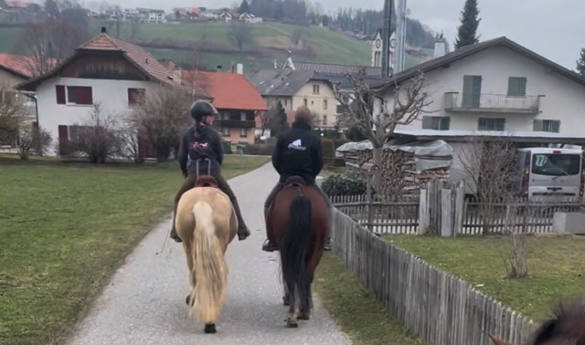

+++
title = "Samba - Mein erster Auftrag"
date = "2024-03-08"
draft = false
pinned = false
image = "mittel-neueste-fotos-anzeigen-2-.jpeg"
+++
Ich habe meinen ersten Auftrag, ein Pferd über einen längeren Zeitraum unter dem Sattel auszubilden.

Auf dem Sellenhof hat sich jemand den Arm gebrochen. Diese Person hatte gerade begonnen, ein Pferd namens Samba zu reiten, das nun regelmässig weiter Geritten werden muss. Da sie dies momentan nicht selbst übernehmen kann, reite ich das Pferd etwa zweimal pro Woche. Dabei verdiene ich nicht nur ein wenig Geld, sondern tue es vor allem aus purer Freude. Zudem sehe ich darin eine grossartige Gelegenheit, für meinen zukünftigen Beruf zu lernen. Je mehr Pferde unterschiedlicher Rassen, Ausbildungsstände und Charaktere ich reiten kann, desto mehr Puzzleteile kann ich sammeln. Auf diese Weise verbessere ich mich ständig und kann besser auf mögliche Probleme in der Pferdeausbildung reagieren.

Es fasziniert mich, wie schnell Jungpferde oder solche, die bisher nicht geritten wurden (wie Samba), lernen. Sobald sie Freude an der Arbeit gefunden haben, streben sie danach, alles richtig zu machen. Außerdem ermöglicht mir die Arbeit mit ihnen, Fortschritte zu sehen, die ich dem Pferd beigebracht habe. Ich erkenne, was gut funktioniert hat, aber auch, wo möglicherweise Fehler gemacht wurden oder wo ich dem Pferd etwas besser erklären muss.

