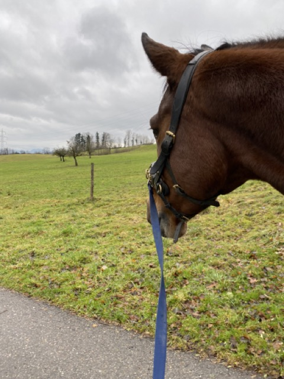
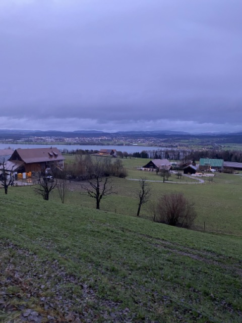

+++
title = "Schnuppern - Hof Neuguet Zürich"
date = "2023-12-15"
draft = false
pinned = false
image = "mittel-img_3769-.jpeg"
+++

Gestern habe ich den gesamten Tag auf einem Hof im Kanton Zürich verbracht, um mir einen Einblick zu verschaffen. Dort werden zahlreiche Jungpferde ausgebildet, aber auch Problempferde betreut, deren Besitzer Schwierigkeiten haben, sie zu handhaben – zum Beispiel aufgrund von Verhaltensweisen wie Steigen, Beissen oder Wegrennen. Die Herausforderung, diese Pferde wieder zu Verlasspferden zu machen, finde ich äusserst faszinierend. Allerdings gibt es auch einige Aspekte, die mir nicht ganz zusagen. Jetzt steht die Auswertung der Vor- und Nachteile an, um zu entscheiden, will ich dort noch mal Schauen gehen 1 Woche und dann eventuell dort ein Praktikum zu machen oder nicht.

Interessant ist dabei, dass die Frau, die den Hof leitet, selbst keine formelle Ausbildung zur Pferdefachfrau EFZ absolviert hat. Stattdessen hat sie sich ihr Wissen in der Pferdebranche durch Trainerscheine und kontinuierliche Weiterbildungen angeeignet.

