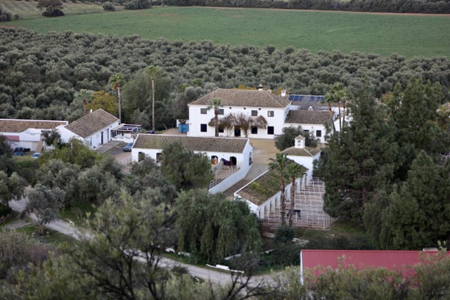
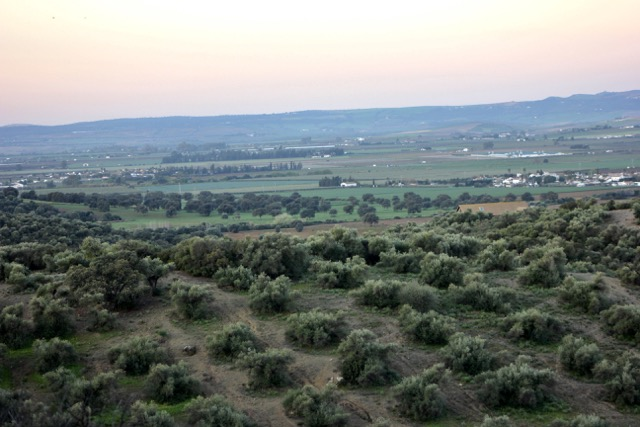
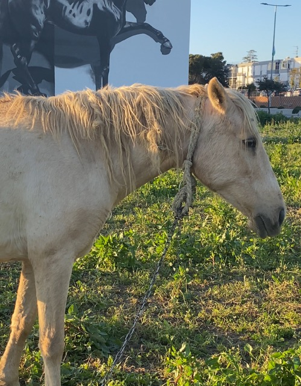
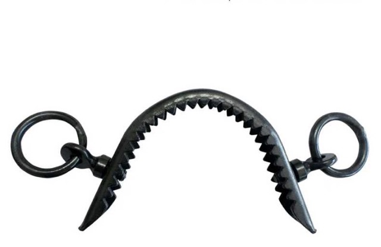
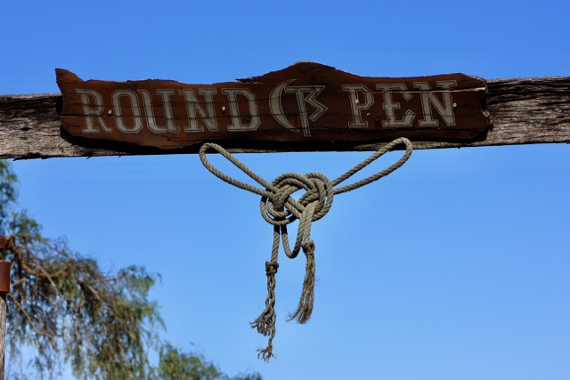
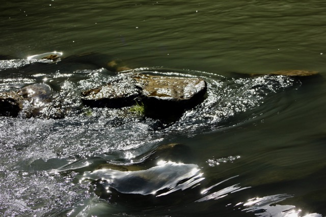
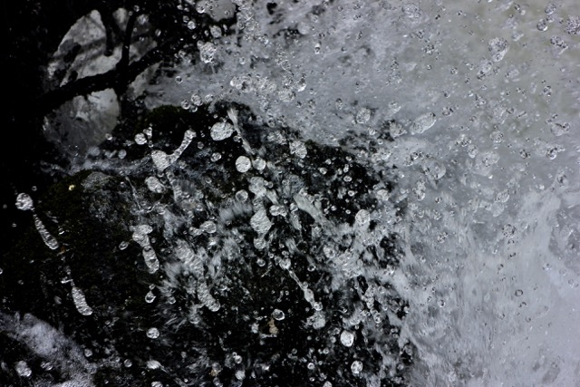

+++
title = "Spanien - Schattenseiten"
date = "2024-03-13"
draft = false
pinned = false
image = "mittel-img_3150-.jpeg"
+++

Ich war kürzlich für eine Woche in Spanien, auf einer Hacienda.

Die Landschaft finde ich wunderschön. Allerdings widerstrebt mir der Umgang mit Pferden, Hunden und anderen Tieren in Spanien zutiefst. Pferde haben in Spanien einen hohen traditionellen Stellenwert, und viele Menschen besitzen ein oder mehrere Pferde. Daher würde man erwarten, dass ein entsprechendes Mass an Wissen vorhanden ist, um die Pferde gesund zu erhalten und sie respektvoll zu trainieren und zu halten. Leider ist das Gegenteil der Fall:

Die Pferde leben dort teilweise mitten in einem Dorf, angebunden an Pfosten mit einem Seil um den Hals. Sie sind ohne Wasser, Schatten oder Schutz vor Witterung neben der Strasse angebunden.

Die Pferde werden meistens mit einem extrem scharfen Gebiss und einer Art Nasenstück geritten. Oftmals von absoluten Reitanfängern. Das Nasenstück sollte nicht einmal von Profis verwendet werden, da es als extrem tierquälerisch (In der Schweiz verboten) einzustufen ist. Die Pferde bluten häufig an der Nase aufgrund der scharfen Zacken. Als "Lösung" stopfen die Menschen vor Ort oft ein Papiertaschentuch darunter, um das Blut aufzufangen. Leider kommt niemand auf die Idee, das Nasenstück zu entfernen.

Das waren nur wenige Beispiele für all die Tiermisshandlungen. Das Schlimmste daran finde ich jedoch, dass es für die Menschen vor Ort völlig normal zu sein scheint und Touristen oft den Mund halten, sich nicht trauen, etwas dagegen zu unternehmen oder auch nur kritisch darüber zu denken.

