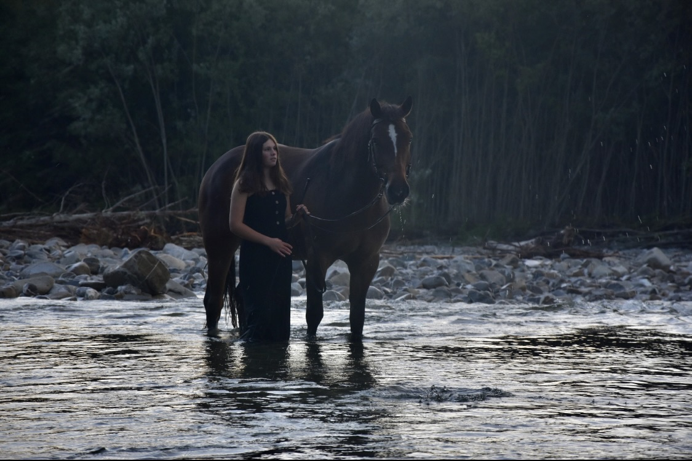

+++
title = "Veränderungen - und meine Angst davor"
date = "2023-11-24"
draft = false
pinned = false
image = "img_8597.jpg"
+++
Ich mache in den nächsten zwei Wochen in einem Praktikum auf einem Hof, wo ich schon seit langem mehrmals die Woche bin. Ich habe bereits mehrere fünftägige Praktika sowie viele Lager auf diesem Hof absolviert.

Obwohl ich mich eigentlich sehr auf diese Zeit gefreut habe, spüre ich jetzt auch ein bisschen Wehmut. Gerade bin ich so glücklich mit meinem Leben und habe so viele tolle Projekte, die mir viel Spaß machen. Ich arbeite auch hier im Efiinger intensiv daran und habe eine tolle Wochenstruktur. Jetzt all das, auch wenn es nur für zwei Wochen ist, aufzugeben, fällt mir nicht ganz leicht.

Letzten Sommer hat es mich genervt, dass ich jetzt noch ein Schuljahr machen muss. Andere sind schon fertig und können eine Lehre oder ähnliches beginnen. Nun, da ich tatsächlich nur noch ein halbes Jahr habe, würde ich die Zeit am liebsten anhalten und alles für immer so haben wollen wie jetzt.

Zum ersten Mal verspüre ich nun etwas Angst vor meinem selbst gewählten Weg. Andere machen eine Lehre oder gehen auf eine weiterführende schule und können oft zuhause wohnen bleiben. Abends bleibt oft noch genügend Freizeit für Aktivitäten mit Freunden oder Familie oder für Hobbys. Ich jedoch gehe weg in einen anderen Kanton, vielleicht sogar in ein anderes Land, weg von meiner Familie, meinen Freunden, weg von meinem gesamten Umfeld, an Orte, wo ich niemanden kenne – und das mit 16!                                                                  Ich denke, das wird nicht einfach für mich, und ich werde vieles vermissen. Trotzdem möchte ich diesen Weg wählen. Ich habe jedoch überlegt, dass ich bis zum Frühling 2025 zum Beispiel einfach zwei oder drei Tage die Woche auf einem Hof in der Nähe arbeiten könnte. Oder auch mal mit einer Pferdetierärztin, einem Hufschmied, einer Pferdeosteopathin mitfahren könnte. So könnte ich noch ein wenig zuhause wohnen, in meinem gewohnten Umfeld bleiben, meine Projekte weiterführen und auch noch zeit für andere dinge habe die mir wichtig sind.

 Auch wenn es mein absoluter Traumberuf ist, ist es doch ein extrem anstrengender Beruf, bei dem man den ganzen Tag körperlich sehr intensiv arbeitet und auch kaum mehr Freizeit hat.

